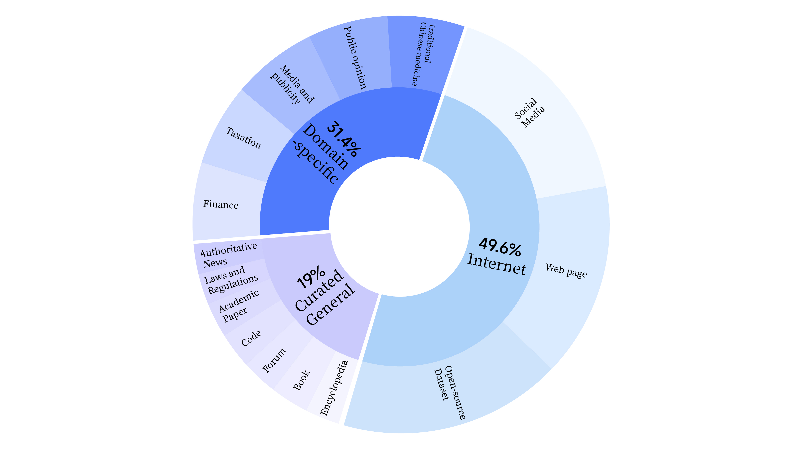
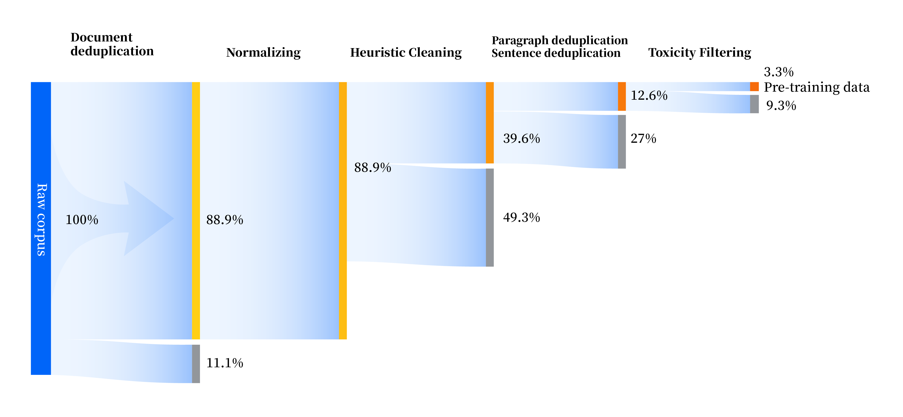

<div align="center">

<br>

[](./LICENSE)
[](./LICENSE_DATA)
[](./LICENSE_MODEL)

[[📖README](./README.md)] 
[[🤗HF Repo](https://huggingface.co/wenge-research)]
[[🔗网页端](https://yayi.wenge.com)]

中文 | [English](./README_EN.md)

</div>


<!-- ## 目录

- [目录](#目录)
- [介绍](#介绍)
- [数据集地址](#数据集地址)
- [模型地址](#模型地址)
- [评测结果](#评测结果)
- [推理](#推理)
  - [环境安装](#环境安装)
  - [Base 模型推理代码](#base-模型推理代码)
- [模型微调](#模型微调)
  - [环境安装](#环境安装-1)
  - [全参训练](#全参训练)
  - [LoRA 微调](#lora-微调)
- [预训练数据](#预训练数据)
- [分词器](#分词器)
- [Loss 曲线](#loss-曲线)
- [相关协议](#相关协议)
  - [开源协议](#开源协议)
  - [引用](#引用) -->

## 更新
[2024.03.28] 所有模型和数据上传魔搭社区。

[2023.12.22] 我们发布了技术报告🔥🔥🔥[YAYI 2: Multilingual Open-Source Large Language Models](https://arxiv.org/abs/2312.14862)。


## 介绍
YAYI 2 是中科闻歌研发的**新一代开源大语言模型**，包括 Base 和 Chat 版本，参数规模为 30B。YAYI2-30B 是基于 Transformer 的大语言模型，采用了超过 2 万亿 Tokens 的高质量、多语言语料进行预训练。针对通用和特定领域的应用场景，我们采用了百万级指令进行微调，同时借助人类反馈强化学习方法，以更好地使模型与人类价值观对齐。

本次开源的模型为 YAYI2-30B Base 模型。我们希望通过雅意大模型的开源来促进中文预训练大模型开源社区的发展，并积极为此做出贡献。通过开源，我们与每一位合作伙伴共同构建雅意大模型生态。

更多技术细节，欢迎阅读我们的技术报告🔥[YAYI 2: Multilingual Open-Source Large Language Models](https://arxiv.org/abs/2312.14862)。


## 数据集地址

| 数据集名称  | 大小  | 🤗 HF模型标识 | 下载地址   |  魔搭模型标识 | 下载地址   | 
|:----------|:----------:|:----------:|----------:|:----------:|----------:|
| YAYI2 Pretrain Data | 500G    | wenge-research/yayi2_pretrain_data| [数据集下载](https://huggingface.co/datasets/wenge-research/yayi2_pretrain_data)|wenge-research/yayi2_pretrain_data| [数据集下载](https://modelscope.cn/datasets/wenge-research/yayi2_pretrain_data)|

## 模型地址

| 模型名称  | 上下文长度  | 🤗 HF模型标识 | 下载地址   |  魔搭模型标识 | 下载地址   | 
|:----------|:----------:|:----------:|----------:|:----------:|----------:|
| YAYI2-30B | 4096    | wenge-research/yayi2-30b| [模型下载](https://huggingface.co/wenge-research/yayi2-30b)|wenge-research/yayi2-30b| [模型下载](https://modelscope.cn/models/wenge-research/yayi2-30b)|
| YAYI2-30B-Chat | 4096    | wenge-research/yayi2-30b-chat| Comming soon... |

## 评测结果

我们在多个基准数据集上进行了评测，包括 C-Eval、MMLU、 CMMLU、AGIEval、GAOKAO-Bench、GSM8K、MATH、BBH、HumanEval 以及 MBPP。我们考察了模型在语言理解、学科知识、数学推理、逻辑推理以及代码生成方面的表现。YAYI 2 模型在与其规模相近的开源模型中展现出了显著的性能提升。

<table id="myTable">
  <!-- Table header -->
  <tr>
        <th></th>
        <th colspan="5" style="text-align: center;">学科知识</th>
        <th colspan="2" style="text-align: center;">数学</th>
        <th colspan="1" style="text-align: center;">逻辑推理</th>
        <th colspan="2" style="text-align: center;">代码</th>
  </tr>
  <tr>
        <th style="text-align: left;">模型</th>
        <th>C-Eval(val)</th>
        <th>MMLU</th>
        <th>AGIEval</th>
        <th>CMMLU</th>
        <th>GAOKAO-Bench</th>
        <th>GSM8K</th>
        <th>MATH</th>
        <th>BBH</th>
        <th>HumanEval</th>
        <th>MBPP</th>
  </tr>
  <tr>
        <td></td>
        <td style="text-align: center;">5-shot</td>
        <td style="text-align: center;">5-shot</td>
        <td style="text-align: center;">3/0-shot</td>
        <td style="text-align: center;">5-shot</td>
        <td style="text-align: center;">0-shot</td>
        <td style="text-align: center;">8/4-shot</td>
        <td style="text-align: center;">4-shot</td>
        <td style="text-align: center;">3-shot</td>
        <td style="text-align: center;">0-shot</td>
        <td style="text-align: center;">3-shot</td>
        </tr>
        <tr>
        <td><strong>MPT-30B</strong></td>
        <td style="text-align: center;">-</td>
        <td style="text-align: center;">46.9</td>
        <td style="text-align: center;">33.8</td>
        <td style="text-align: center;">-</td>
        <td style="text-align: center;">-</td>
        <td style="text-align: center;">15.2</td>
        <td style="text-align: center;">3.1</td>
        <td style="text-align: center;">38.0</td>
        <td style="text-align: center;">25.0</td>
        <td style="text-align: center;">32.8</td>
  </tr>
  <tr>
        <td><strong>Falcon-40B</strong></td>
        <td style="text-align: center;">-</td>
        <td style="text-align: center;">55.4</td>
        <td style="text-align: center;">37.0</td>
        <td style="text-align: center;">-</td>
        <td style="text-align: center;">-</td>
        <td style="text-align: center;">19.6</td>
        <td style="text-align: center;">5.5</td>
        <td style="text-align: center;">37.1</td>
        <td style="text-align: center;">0.6</td>
        <td style="text-align: center;">29.8</td>
  </tr>
  <tr>
        <td><strong>LLaMA2-34B</strong></td>
        <td style="text-align: center;">-</td>
        <td style="text-align: center;">62.6</td>
        <td style="text-align: center;">43.4</td>
        <td style="text-align: center;">-</td>
        <td style="text-align: center;">-</td>
        <td style="text-align: center;">42.2</td>
        <td style="text-align: center;">6.2</td>
        <td style="text-align: center;">44.1</td>
        <td style="text-align: center;">22.6</td>
        <td style="text-align: center;">33.0</td>
  </tr>
  <tr>
        <td><strong>Baichuan2-13B</strong></td>
        <td style="text-align: center;">59.0</td>
        <td style="text-align: center;">59.5</td>
        <td style="text-align: center;">37.4</td>
        <td style="text-align: center;">61.3</td>
        <td style="text-align: center;">45.6</td>
        <td style="text-align: center;">52.6</td>
        <td style="text-align: center;">10.1</td>
        <td style="text-align: center;">49.0</td>
        <td style="text-align: center;">17.1</td>
        <td style="text-align: center;">30.8</td>
  </tr>
  <tr>
        <td><strong>Qwen-14B</strong></td>
        <td style="text-align: center;">71.7</td>
        <td style="text-align: center;">67.9</td>
        <td style="text-align: center;">51.9</td>
        <td style="text-align: center;">70.2</td>
        <td style="text-align: center;">62.5</td>
        <td style="text-align: center;">61.6</td>
        <td style="text-align: center;">25.2</td>
        <td style="text-align: center;">53.7</td>
        <td style="text-align: center;">32.3</td>
        <td style="text-align: center;">39.8</td>
  </tr>
  <tr>
        <td><strong>InternLM-20B</strong></td>
        <td style="text-align: center;">58.8</td>
        <td style="text-align: center;">62.1</td>
        <td style="text-align: center;">44.6</td>
        <td style="text-align: center;">59.0</td>
        <td style="text-align: center;">45.5</td>
        <td style="text-align: center;">52.6</td>
        <td style="text-align: center;">7.9</td>
        <td style="text-align: center;">52.5</td>
        <td style="text-align: center;">25.6</td>
        <td style="text-align: center;">35.6</td>
  </tr>
  <tr>
        <td><strong>Aquila2-34B</strong></td>
        <td style="text-align: center;">98.5</td>
        <td style="text-align: center;">76.0</td>
        <td style="text-align: center;">43.8</td>
        <td style="text-align: center;">78.5</td>
        <td style="text-align: center;">37.8</td>
        <td style="text-align: center;">50.0</td>
        <td style="text-align: center;">17.8</td>
        <td style="text-align: center;">42.5</td>
        <td style="text-align: center;">0.0</td>
        <td style="text-align: center;">41.0</td>
  </tr>
  <tr>
        <td><strong>Yi-34B</strong></td>
        <td style="text-align: center;">81.8</td>
        <td style="text-align: center;">76.3</td>
        <td style="text-align: center;">56.5</td>
        <td style="text-align: center;">82.6</td>
        <td style="text-align: center;">68.3</td>
        <td style="text-align: center;">67.6</td>
        <td style="text-align: center;">15.9</td>
        <td style="text-align: center;">66.4</td>
        <td style="text-align: center;">26.2</td>
        <td style="text-align: center;">38.2</td>
  </tr>
  <tr>
        <td><strong>YAYI2-30B</strong></td>
        <td style="text-align: center;">80.9</td>
        <td style="text-align: center;">80.5</td>
        <td style="text-align: center;"><b>62.0</b></td>
        <td style="text-align: center;"><b>84.0</b></td>
        <td style="text-align: center;">64.4</td>
        <td style="text-align: center;"><b>71.2</b></td>
        <td style="text-align: center;">14.8</td>
        <td style="text-align: center;">54.5</td>
        <td style="text-align: center;"><b>53.1</b></td>
        <td style="text-align: center;"><b>45.8</b></td>
  </tr>
</table>

我们使用 [OpenCompass Github 仓库](https://github.com/open-compass/opencompass) 提供的源代码进行了评测。对于对比模型，我们列出了他们在 [OpenCompass](https://opencompass.org.cn) 榜单上的评测结果，截止日期为 2023年12月15日。对于其他尚未在 [OpenCompass](https://opencompass.org.cn/leaderboard-llm) 平台参与评测的模型，包括 MPT、Falcon 和 LLaMa 2，我们采用了 [LLaMA 2](https://arxiv.org/abs/2307.09288) 报告的结果。


## 推理

我们提供简单的示例来说明如何快速使用 `YAYI2-30B` 进行推理。该示例可在单张 A100/A800 上运行。

### 环境安装


1. 克隆本仓库内容到本地环境

```bash
git clone https://github.com/wenge-research/YAYI2.git
cd YAYI2
```

2. 创建 conda 虚拟环境
   
```bash
conda create --name yayi_inference_env python=3.8
conda activate yayi_inference_env
```
请注意，本项目需要 Python 3.8 或更高版本。

3. 安装依赖

```
pip install transformers==4.33.1
pip install torch==2.0.1
pip install sentencepiece==0.1.99
pip install accelerate==0.25.0
```


### Base 模型推理代码

```python
>>> from transformers import AutoModelForCausalLM, AutoTokenizer
>>> tokenizer = AutoTokenizer.from_pretrained("wenge-research/yayi2-30b", trust_remote_code=True)
>>> model = AutoModelForCausalLM.from_pretrained("wenge-research/yayi2-30b", device_map="auto", trust_remote_code=True)
>>> inputs = tokenizer('The winter in Beijing is', return_tensors='pt')
>>> inputs = inputs.to('cuda')
>>> pred = model.generate(
        **inputs, 
        max_new_tokens=256, 
        eos_token_id=tokenizer.eos_token_id, 
        do_sample=True,
        repetition_penalty=1.2,
        temperature=0.4, 
        top_k=100, 
        top_p=0.8
        )
>>> print(tokenizer.decode(pred.cpu()[0], skip_special_tokens=True))
```
当您首次访问时，需要下载并加载模型，可能会花费一些时间。


## 模型微调
本项目支持基于分布式训练框架 deepspeed 进行指令微调，配置好环境并执行相应脚本即可启动全参数微调或 LoRA 微调。


### 环境安装


1. 创建 conda 虚拟环境：
   
```bash
conda create --name yayi_train_env python=3.10
conda activate yayi_train_env
```

2. 安装依赖：

```bash
pip install -r requirements.txt
```

3. 安装 accelerate：

```bash
pip install --upgrade accelerate
```

4. 安装 flashattention：

```bash
pip install flash-attn==2.0.3 --no-build-isolation
pip install triton==2.0.0.dev20221202  --no-deps 
```


### 全参训练

* 数据格式：参考 `data/yayi_train_example.json`，是一个标准 JSON 文件，每条数据由 `"system" `和 `"conversations"` 组成，其中 `"system"` 为全局角色设定信息，可为空字符串，`"conversations"` 是由 human 和 yayi 两种角色交替进行的多轮对话内容。

* 运行说明：运行以下命令即可开始全参数微调雅意模型，该命令支持多机多卡训练，建议使用 16*A100(80G) 或以上硬件配置。

```bash
deepspeed --hostfile config/hostfile \
    --module training.trainer_yayi2 \
    --report_to "tensorboard" \
    --data_path "./data/yayi_train_example.json" \
    --model_name_or_path "your_model_path" \
    --output_dir "./output" \
    --model_max_length 2048 \
    --num_train_epochs 1 \
    --per_device_train_batch_size 1 \
    --gradient_accumulation_steps 1 \
    --evaluation_strategy "no" \
    --save_strategy "steps" \
    --save_steps 500 \
    --save_total_limit 10 \
    --learning_rate 5e-6 \
    --warmup_steps 2000 \
    --lr_scheduler_type cosine \
    --logging_steps 1 \
    --gradient_checkpointing True \
    --deepspeed "./config/deepspeed.json" \
    --bf16 True 
```

或者通过命令行启动：
```bash
bash scripts/start.sh
```


### LoRA 微调

* 数据格式：同上，参考 data/yayi_train_example_multi_rounds.json。
* 运行以下命令即可开始 LoRA 微调雅意模型。

```bash
bash scripts/start_lora.sh
```

## 预训练数据

* 在预训练阶段，我们不仅使用了互联网数据来训练模型的语言能力，还添加了通用精选数据和领域数据，以增强模型的专业技能。数据分布情况如下：


* 我们构建了一套全方位提升数据质量的数据处理流水线，包括标准化、启发式清洗、多级去重、毒性过滤四个模块。我们共收集了 240TB 原始数据，预处理后仅剩 10.6TB 高质量数据。整体流程如下：



## 分词器
* YAYI 2 采用 Byte-Pair Encoding（BPE）作为分词算法，使用 500GB 高质量多语种语料进行训练，包括汉语、英语、法语、俄语等十余种常用语言，词表大小为 81920。
* 我们对数字进行逐位拆分，以便进行数学相关推理；同时，在词表中手动添加了大量HTML标识符和常见标点符号，以提高分词的准确性。另外，我们预设了200个保留位，以便未来可能的应用，例如在指令微调阶段添加标识符。由于是字节级别的分词算法，YAYI 2 Tokenizer 可以覆盖未知字符。
* 我们采样了单条长度为 1万 Tokens 的数据形成评价数据集，涵盖中文、英文和一些常见小语种，并计算了模型的压缩比。


* 压缩比越低通常表示分词器具有更高效率的性能。

## Loss 曲线
YAYI 2 模型的 loss 曲线见下图：


## 相关协议

### 开源协议

本项目中的代码依照 [Apache-2.0](LICENSE) 协议开源，社区使用 YAYI 2 模型和数据需要遵循[《雅意 YAYI 2 模型社区许可协议》](COMMUNITY_LICENSE)。若您需要将雅意 YAYI 2系列模型或其衍生品用作商业用途，请完整填写[《雅意 YAYI 2 模型商用登记信息》](REGISTRATION_INFORMATION)，并发送至 yayi@wenge.com，收到邮件后我们将在3个工作日进行审核，通过审核后您将收到商用许可证，请您在使用过程中严格遵守[《雅意 YAYI 2 模型商用许可协议》](COMMERCIAL_LICENSE)的相关内容，感谢您的配合！

### 引用
如果您在工作中使用了我们的模型，请引用我们的论文：

```
@article{YAYI 2,
  author    = {Yin Luo, Qingchao Kong, Nan Xu, et.al.},
  title     = {YAYI 2: Multilingual Open Source Large Language Models},
  journal   = {arXiv preprint arXiv:2312.14862},
  url       = {https://arxiv.org/abs/2312.14862},
  year      = {2023}
}
```

## Star History
[](https://star-history.com/#wenge-research/YAYI2&Date)
